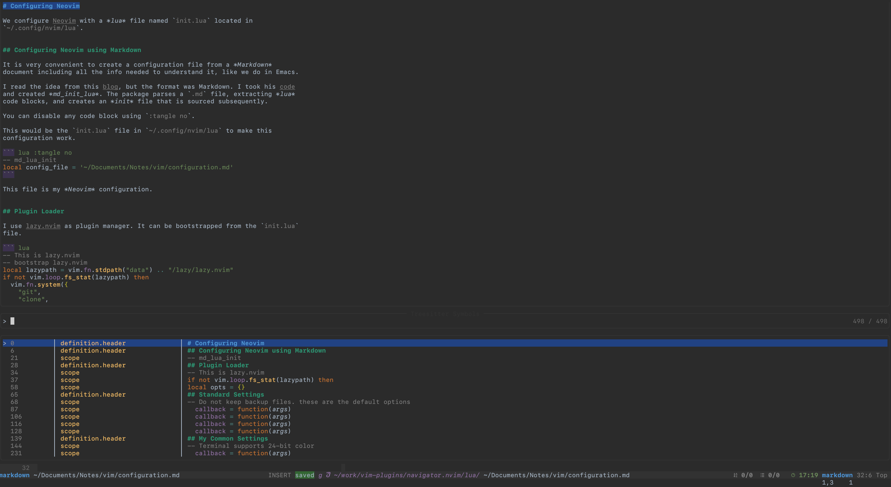

# navigator.nvim

## Introduction

`navigator.nvim` is an extension for *Neovim* that uses
*tree-sitter* to parse code queries for the main language of a file and
any other injected languages present, and provides a [Telescope](https://github.com/nvim-telescope/telescope.nvim) based
interface to navigate the file. It can be downloaded [here](https://github.com/dawsers/navigator.nvim).

The plugin uses `tree-sitter`'s `LanguageTree` through the `lua`
`vim.treesitter.languagetool` module to detect injected language blocks
in the parent file, and apply the queries to every language present, so you
can navigate the file including all the embedded code, as for example in
*Markdown* files with fenced code blocks. Of course, it also works for single
language files.



To navigate the *tree-sitter* trees, you need to provide queries to identify
those regions of interest. *navigate.nvim* provides some included queries, but
you can customize everything.

There is also the possibility to add regular expression queries, for those
captures not supported by the *tree-sitter* parser. For example, *Markdown*
tags are disabled by default in the `markdown_inline` parser, but you can add
a custom *regex* query in `navigator.nvim` to include them.

## Requirements

`navigator.nvimm` requires a version of *Neovim* with a recent
`tree-sitter` version enabled (probably 0.9 or newer, I tested it on
0.9). It also depends on [Telescope](https://github.com/nvim-telescope/telescope.nvim) for the user interface.

You will also need to have enabled in your configuration all the *tree-sitter* parsers
for the languages you want to use. For example, if you are interested in
`markdown`, `lua`, and `python`, you need to enable the three parsers in
your *Neovim* configuration.


## Installation and Configuration

Install using [Plug](https://github.com/junegunn/vim-plug).

``` vim
Plug 'dawsers/navigator.nvim'
```

or [lazy.nvim](https://github.com/folke/lazy.nvim)

There are no default key bindings or exposed commands, so you need to customize
some, or call the `navigate()` function from *lua*.

``` lua
table.insert(plugins, {
  'dawsers/navigator.nvim',
  config = function()
    local navigator = require('navigator')
    vim.keymap.set("n", "<space>n", function()
        navigator.navigate()
      end, { desc = 'navigator' })
  end,
})
```

### `navigate()`

`require('navigator').navigate(opts)` is the entry point to the extension. It
accepts a table (`opts`) with the following fields:

``` lua
local opts = {
  query_list = {
  .... -- queries
  },
  language_list = { ... }, -- only languages to consider
  symbol_list = { ... }, -- only symbols to consider
}
```

### `language_list` and `symbol_list`

If you don't specify any `language_list`, `navigator.nvim`
will detect all the languages embedded in the file and prepare the queries for
all of them.

If you don't specify any `symbol_list`, `navigator.nvim`
will apply the queries for all the symbols in the query_list.

So those two lists are just for convenience, in case your query files contain
lots of captures and you want to call `navigator.nvim` with a more reduced
set before applying any filtering using the *Telescope* interface.

But the user interface in *Telescope* allows a very easy selection of
languages and symbols.


### User Interface

When you are in the main picker, "Treesitter Symbols", `<C-l>` (*languages*)
will take you to a second picker where you can select all the languages you
want to use (of those embedded in the file). Use your *Telescope*
multi-selection key binding (mine is `<TAB>`) to select or un-select any of
the listed languages. From there, you can press `<C-n>` (*navigate*) again and
return to the main window, where the filter will have been applied. If instead
of `<C-l>`, you press `<C-s>` (*symbols*), you will be taken to the symbol
picker, where there is a list of symbols present in the available queries,
ordered by language. Select as many as you want, and press `<C-n>` to navigate
back to the main window to see the filter applied. So `<C-l>` (*languages*) and
`<C-s>` (*symbols*) are pickers to create filters that get applied when you
press `<C-n>` and go back to the main window with the preview.

### `query_list`

If you don't specify a `query_list` within the options passed to `navigate()`,
the extension will use some defaults. These are included in
`lua/navigator/queries.lua`. Those queries are not a very curated list, being based
mainly on `locals.scm` queries for the different languages. But the file
provides a good idea of what is possible when you want to customize
`navigator.nvim`


## Advanced Use

Let's create an example `query_list`.

``` lua
-- A query list is an array or queries. You can have as many queries you
-- want per language, but each query can include many captures too.
local query_list = {
  {
    -- Each query has to specify the parser it applies to.
    -- It is the only required parameter.
    parser = 'markdown',
    -- This trees-sitter query will create captions for Markdown headers
    query = [[
      [
        (atx_heading (atx_h1_marker))
        (atx_heading (atx_h2_marker))
        (atx_heading (atx_h3_marker))
        (atx_heading (atx_h4_marker))
        (atx_heading (atx_h5_marker))
        (atx_heading (atx_h6_marker))
        (setext_heading (setext_h1_underline))
        (setext_heading (setext_h2_underline))
      ] @definition.header

      ((atx_heading (atx_h1_marker)) @definition.header.h1)
      ((atx_heading (atx_h2_marker)) @definition.header.h2)
      ((atx_heading (atx_h3_marker)) @definition.header.h3)
      ((atx_heading (atx_h4_marker)) @definition.header.h4)
      ((atx_heading (atx_h5_marker)) @definition.header.h5)
      ((atx_heading (atx_h6_marker)) @definition.header.h6)
      ((setext_heading (setext_h1_underline)) @definition.header.h1)
      ((setext_heading (setext_h2_underline)) @definition.header.h2)
    ]],
    -- You can also add regex queries that will result in captions with
    -- `name`. The `expr` is a vim regular expression. You can add as many
    -- as you want per query
    regex = {
      { name = 'definition.regex_tag', expr = [[#[a-zA-Z_\-\/][0-9a-zA-Z_\-\/]*]] },
    }
  },
  {
    parser = 'lua',
    -- navigator.nvim includes a `read_file` function for convenience. It can
    -- read any query file into a string
    -- This query is the result of reading a `locals.scm` query file in
    -- Neovim's runtime path, probably from nvim-treesitter
    query = require('navigator.queries').read_file(vim.api.nvim_get_runtime_file(string.format("queries/%s/%s.scm", 'lua', 'locals'), true)[1]),
  },
}

-- Now use this query_list in a personalized invocation of navigate.nvim
vim.keymap.set("n", "<space>n", function()
  require('navigator').navigate({
    query_list = query_list,
  })
  end, { desc = 'navigator' })
```

